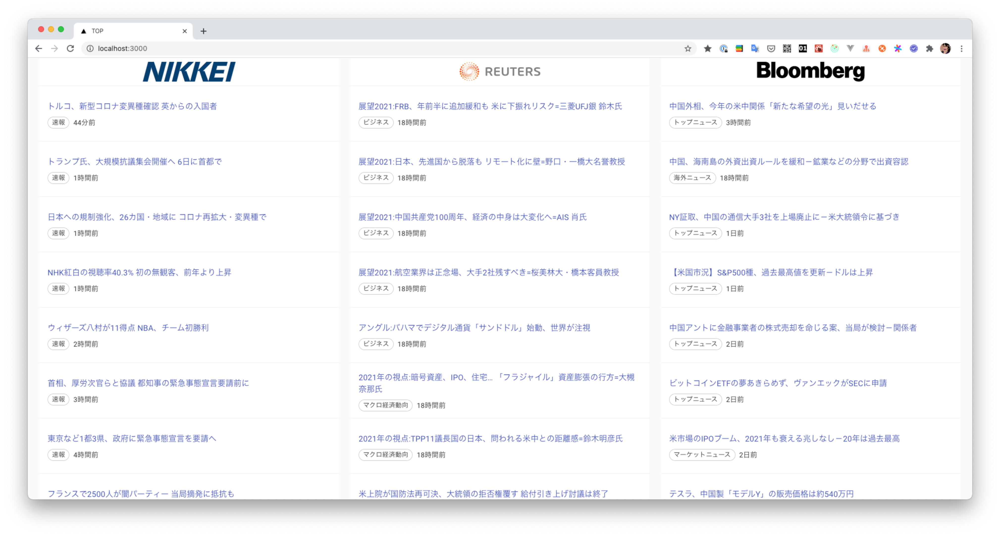

# investment-support-for-nuxtjs


## 環境構築
ルートディレクトリに `.env.local` ファイルを作成し、下記をコピーペーストしてください

```.dotenv
NEXT_PUBLIC_RSS_BASE_URL='https://assets.wor.jp/rss/rdf/'
NEXT_PUBLIC_API_BASE_URL='http://localhost:3000/api/'
```

`.env.local` を作成後にローカルdev環境を起動します

```bash
yarn dev
```

ブラウザを開いて `localhost:3000` へアクセスしてください

下記画面を表示できれば完了です


